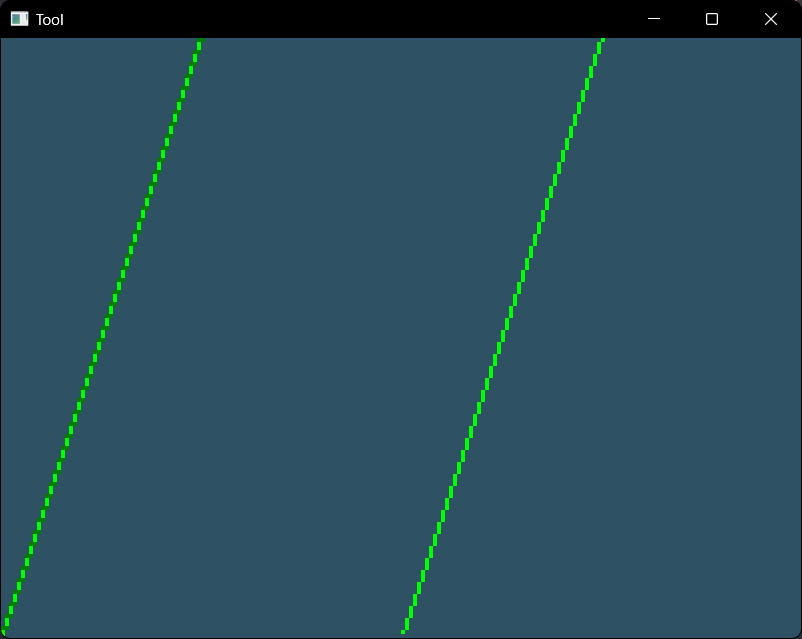
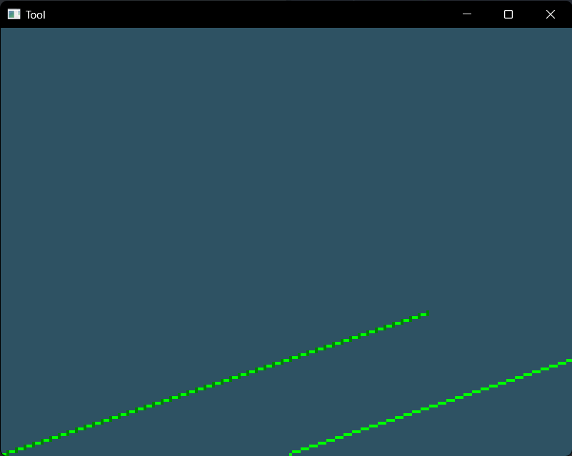
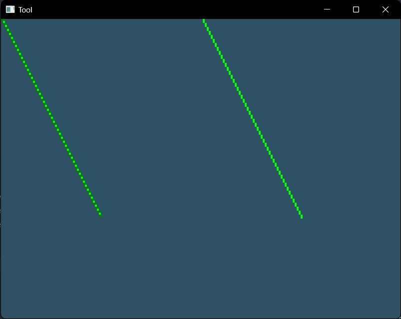
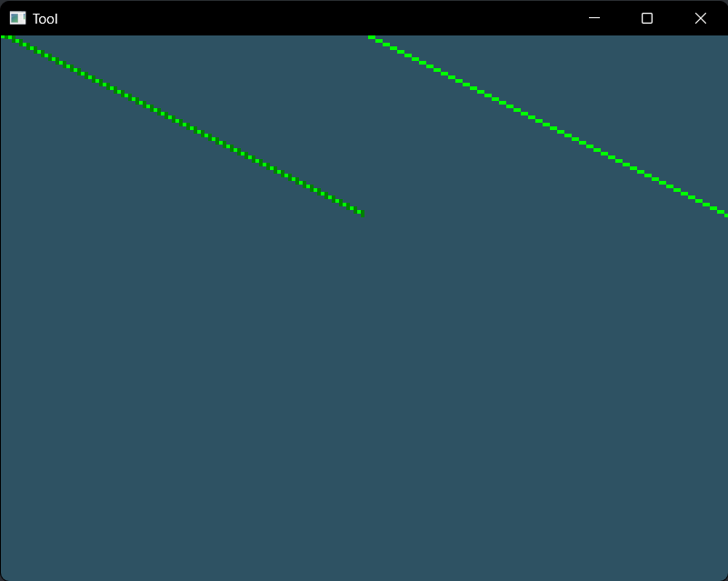

# 实验报告

| 课程名称：计算机图形学理论和应用 | 年级：大三  |
| -------------------------------- | ----------- |
| **指导教师：董兰芳**             | **姓名： ** |
| **实验名称：直线段的反走样算法** | **学号： ** |

## 一、提交文件

main.cpp

Tool.h

## 二、实验环境

1. 操作系统：Windows11

2. 编程软件：VSCode Opengl(glad glfw)

## 三、实验内容

### 1.实验内容和实现功能

实现直线段的反走样算法。

### 2.难点及解决方案

- 在现代opengl核心模式画点：在画点时限制绘制区域为要画像素点的位置，画一个覆盖绘制区域的矩形，就可以仅在绘制区域画点
- 实现任意斜率的画线算法：实现bresenham画线算法
- 实现直线段的反走样：通过将一个像素点划分为更小的部分，用过取样来实现反走样算法，在高分辨率下取样来确定各个像素的适合亮度等级

### 3.算法思想

使用bresenham画线算法，在其基础上用过取样来实现反走样算法，把屏幕看做比实际更细的网格所覆盖，从而增加取样频率，然后根据这种更细的网格，确定各个像素的适合亮度等级，在低分辨率下显示。

<div STYLE="page-break-after: always;"></div>

### 4.实现流程图

```mermaid
flowchart TD
subgraph main
A1[start] --> B1[读取模型文件]
B1 --> C1[初始化]
C1 --> D1[检查事件触发]
D1 --> E1[处理输入]
E1 --> F1[绘制反走样曲线]
F1 --> G1[绘制原始曲线]
G1 --> D1
G1 --窗口退出--> H1[内存释放]
H1 --> I1[End]
end
subgraph bresenham
A2[数据预处理] --> B2[计算初始决策参数]
B2 --> C2[沿绘制方向增加坐标]
C2 --> D2[决策参数判断]
D2 --> E2[另一坐标移动]
D2 --> F2[另一坐标不移动]
E2 --> G2[更新决策参数]
F2 --> G2
G2 --> H2[画点]
H2 --> C2
end
subgraph bresenham_antialiasing
A3[数据预处理] --> B3[计算初始决策参数]
B3 --> C3[沿绘制方向增加坐标]
C3 --> D3[决策参数判断]
D3 --> E3[另一坐标移动]
D3 --> F3[另一坐标不移动]
E3 --> G3[更新决策参数]
F3 --> G3
G3 --> H3[判断是否超出低分辨率对应的像素]
H3 --是--> I3[计算亮度等级 画点 重置区间]
H3 --否--> C3
I3 --> C3
end
subgraph setPixel
A4[设置颜色] --> B4[设置绘制范围]
B4 --> C4[绘制填充矩形]
end
```



### 5.关键代码

#### bresenham

```c++
void bresenham(Tool tool, int x1, int y1, int x2, int y2) {
    if (x2 - x1 < 0) {
        int x0 = x2;
        int y0 = y2;
        x2 = x1;
        y2 = y1;
        x1 = x0;
        y1 = y0;
    }

    int dx = x2 - x1, dy = y2 - y1;
    int x0 = x1, y0 = y1;

    if (dy > 0) {
        if (dx > dy) {
            int pk = 2 * dy - dx;
            for (int i = 1; i <= dx; i++) {
                x0 += 1;
                if (pk < 0) {
                    pk += 2 * dy;
                } else {
                    y0 += 1;
                    pk += 2 * dy - 2 * dx;
                }
                const Color green{0.0f, 1.0f, 0.0f, 1.0f};
                tool.setPixel(x0, y0, green);
            }
        } else {
            int pk = 2 * dx - dy;
            for (int i = 1; i <= dy; i++) {
                y0 += 1;
                if (pk < 0) {
                    pk += 2 * dx;
                } else {
                    x0 += 1;
                    pk += 2 * dx - 2 * dy;
                }
                const Color green{0.0f, 1.0f, 0.0f, 1.0f};
                tool.setPixel(x0, y0, green);
            }
        }
    } else {
        if (dx > -dy) {
            int pk = 2 * dy + dx;
            for (int i = 1; i <= dx; i++) {
                x0 += 1;
                if (pk > 0) {
                    pk += 2 * dy;
                } else {
                    y0 -= 1;
                    pk += 2 * dy + 2 * dx;
                }
                const Color green{0.0f, 1.0f, 0.0f, 1.0f};
                tool.setPixel(x0, y0, green);
            }
        } else {
            int pk = -2 * dx - dy;
            for (int i = 1; i <= -dy; i++) {
                y0 -= 1;
                if (pk < 0) {
                    pk += 2 * dx;
                } else {
                    x0 += 1;
                    pk += 2 * dx + 2 * dy;
                }
                const Color green{0.0f, 1.0f, 0.0f, 1.0f};
                tool.setPixel(x0, y0, green);
            }
        }
    }
}
```

#### bresenham_antialiasing

```c++
void bresenham_antialiasing(Tool tool, int x1, int y1, int x2, int y2, int N=2) {
    if (x2 - x1 < 0) {
        int x0 = x2;
        int y0 = y2;
        x2 = x1;
        y2 = y1;
        x1 = x0;
        y1 = y0;
    }

    int dx = x2 - x1, dy = y2 - y1;
    int x0 = x1, y0 = y1;
    int lastx = x1, lasty = y1;
    int num = 0;

    if (dy > 0) {
        if (dx > dy) {
            int pk = 2 * dy * N - dx * N;
            for (int i = 1; i <= dx * N; i++) {
                num++;
                x0 += 1;
                if (pk < 0) {
                    pk += 2 * dy * N;
                } else {
                    y0 += 1;
                    pk += 2 * dy * N - 2 * dx * N;
                }
                if (((x0 - x1) / N != (lastx - x1) / N) || ((y0 - y1) / N != (lasty - y1) / N)) {
                    float value = num / (N * 1.0);
                    const Color green{0.0f, value, 0.0f, 1.0f};
                    tool.setPixel(x1 + (lastx - x1) / N, y1 + (lasty - y1) / N, green);
                    lastx = x0;
                    lasty = y0;
                    num = 0;
                }
            }
        } else {
            int pk = 2 * dx * N - dy * N;
            for (int i = 1; i <= dy * N; i++) {
                num++;
                y0 += 1;
                if (pk < 0) {
                    pk += 2 * dx * N;
                } else {
                    x0 += 1;
                    pk += 2 * dx * N - 2 * dy * N;
                }
                if (((x0 - x1) / N != (lastx - x1) / N) || ((y0 - y1) / N != (lasty - y1) / N)) {
                    float value = num / (N * 1.0);
                    const Color green{0.0f, value, 0.0f, 1.0f};
                    tool.setPixel(x1 + (lastx - x1) / N, y1 + (lasty - y1) / N, green);
                    lastx = x0;
                    lasty = y0;
                    num = 0;
                }
            }
        }
    } else {
        if (dx > -dy) {
            int pk = 2 * dy * N + dx * N;
            for (int i = 1; i <= dx * N; i++) {
                num++;
                x0 += 1;
                if (pk > 0) {
                    pk += 2 * dy * N;
                } else {
                    y0 -= 1;
                    pk += 2 * dy * N + 2 * dx * N;
                }
                if (((x0 - x1) / N != (lastx - x1) / N) || ((y0 - y1) / N != (lasty - y1) / N)) {
                    float value = num / (N * 1.0);
                    const Color green{0.0f, value, 0.0f, 1.0f};
                    tool.setPixel(x1 + (lastx - x1) / N, y1 + (lasty - y1) / N, green);
                    lastx = x0;
                    lasty = y0;
                    num = 0;
                }
            }
        } else {
            int pk = -2 * dx * N - dy * N;
            for (int i = 1; i <= -dy * N; i++) {
                num++;
                y0 -= 1;
                if (pk < 0) {
                    pk += 2 * dx * N;
                } else {
                    x0 += 1;
                    pk += 2 * dx * N + 2 * dy * N;
                }
                if (((x0 - x1) / N != (lastx - x1) / N) || ((y0 - y1) / N != (lasty - y1) / N)) {
                    float value = num / (N * 1.0);
                    const Color green{0.0f, value, 0.0f, 1.0f};
                    tool.setPixel(x1 + (lastx - x1) / N, y1 + (lasty - y1) / N, green);
                    lastx = x0;
                    lasty = y0;
                    num = 0;
                }
            }
        }
    }
}
```

### 6.运行截图

#### 斜率大于1



#### 斜率大于0小于1



#### 斜率小于-1



#### 斜率大于-1小于0



## 四、实验总结

在本次实验中，学习了使用opengl实现直线段的反走样算法，对bresenham画线算法以及在现代opengl核心模式画点的方法有了深入的理解。
