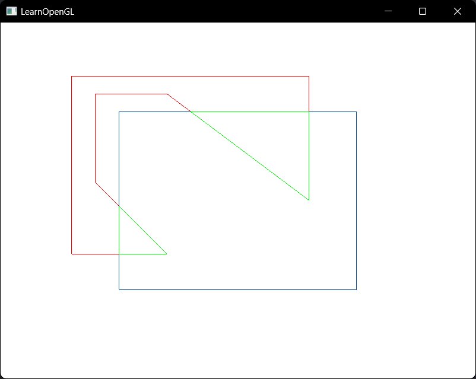
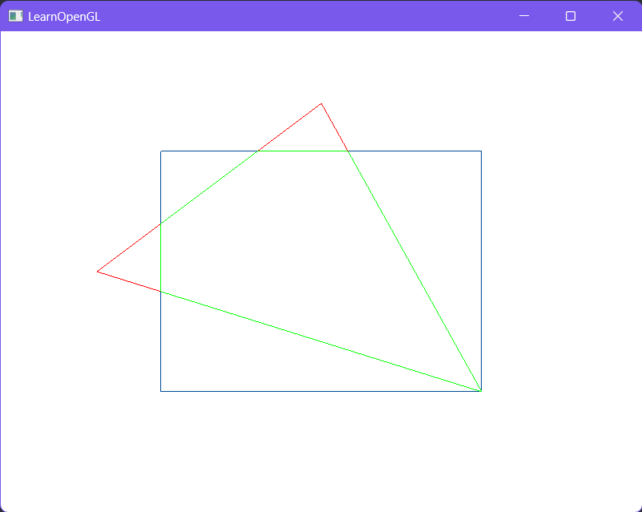
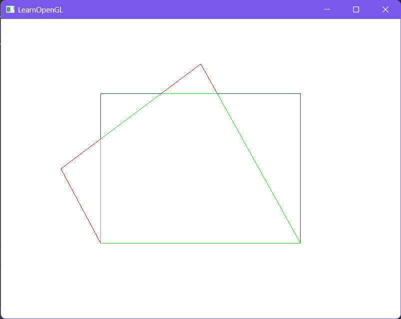
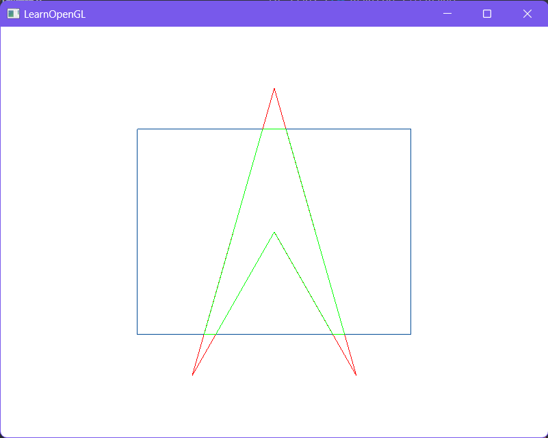
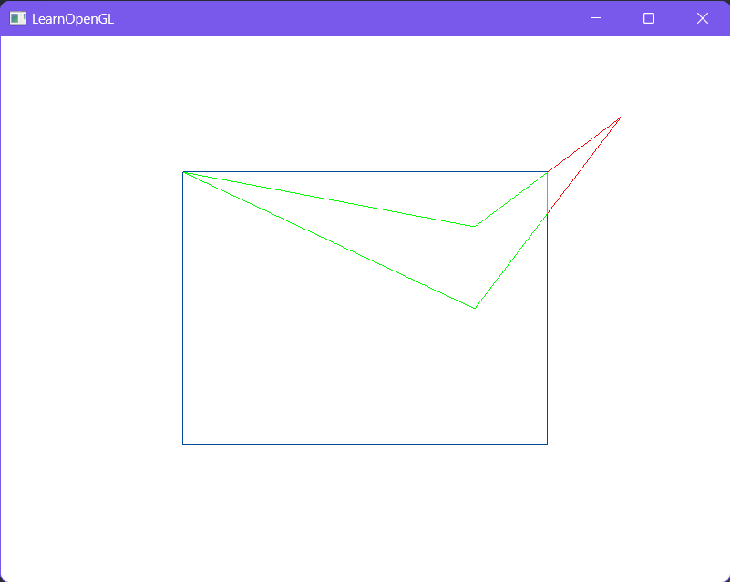

# 实验报告

| 课程名称：计算机图形学理论和应用                   | 年级：大三  |
| -------------------------------------------------- | ----------- |
| **指导教师：董兰芳**                               | **姓名： ** |
| **实验名称：实现凹多边形相对于矩形窗口的裁剪算法** | **学号： ** |

## 一、提交文件

main.cpp

fragmentShader.fs

vertexShader.vs

learnopengl/shader_m.h

## 二、实验环境

1. 操作系统：Windows11

2. 编程软件：VSCode Opengl(glad glfw)

## 三、实验内容

### 1.实验内容和实现功能

实现凹多边形相对于矩形窗口的裁剪算法。

### 2.难点及解决方案

- 使用什么算法实现：使用Weiler_Atherton算法
- 如何判断两个直线段是否相交：利用相交线段的端点对另一线段的叉乘方向来实现，例如线段A1A2和线段B1B2，当两线段相交时，A1B1和B1B2的叉乘方向 与 A2B1和B1B2的叉乘方向相反，B1A1和A1A2的叉乘方向 与 B2A1和A1A2的叉乘方向相反。
- 判断点是否在多边形内部：使用射线法，当从点引出的一条射线与多边形有奇数个交点时，该点在多边形内部。同时加入微小扰动以处理边界情况
- 计算两个直线段的交点：过其中的一个线段的两端点向另一个线段做垂线，利用参数方程求交点

### 3.算法思想

对于逆时针的多边形填充区顶点顺序，使用Weiler_Atherton算法，算法流程如下

- 1.按逆时针方向处理多边形填充区，直到一对内外顶点与某裁剪边界相遇，即多边形边的第一顶点在裁剪窗口内而第二顶点在裁剪窗口外
- 2.在窗口边界上从出交点逆时针方向到达另一个与多边形的交点，如该点是处理边的点，则走向下一步。如果是新交点，则继续按逆时针方向处理多边形直到遇见已处理的顶点。
- 3.形成裁剪后该区域的顶点队列
- 4.回到出交点并继续按逆时针处理多边形的边

<div STYLE="page-break-after: always;"></div>

### 4.实现流程图

```mermaid
flowchart TD
subgraph main
A1[start] --> B1[初始化]
B1 --> C1[进入多边形1]
C1 --> D1[若当前点已遍历输出裁剪后多边形]
D1 --> E1[标记当前点]
E1 --出点--> F1[进入多边形2]
F1 --> G1[若当前点已遍历输出裁剪后多边形]
G1 --> H1[标记当前点]
H1 --出点--> C1
H1 --> I1[End]
end
subgraph intersect_point
A2[从叉乘判断是否相交] --相交--> B2[计算交点]
A2 --不相交--> C2[设置交点为-1 -1]
B2 --> D2[返回交点]
C2 --> D2
end
subgraph is_in_polygon
A3[加入微小扰动] --> B3[计算射线与各边交点个数]
B3 --奇数--> C3[多边形内部]
B3 --偶数--> D3[多边形外部]
end
subgraph polygon_intersect
A4[从多边形1中取一个点A] --> B4[计算该点A和下一点B与多边形2的交点]
B4 --> C4[将交点按与点A的距离排序]
C4 --> D4[将交点插入多边形1中]
D4 --> A4
end
```



### 5.关键代码

#### 基本数据结构

```c++
class Point {
public:
    double x, y;
    int type = 0;
};

class Line {
public:
    Point p1, p2;
};
```

#### 距离、叉乘

```c++
double multiplication_cross(Line l, Point p) {
    return (l.p2.x - l.p1.x) * (p.y - l.p1.y) - (l.p2.y - l.p1.y) * (p.x - l.p1.x);
}

double distance(Point p1, Point p2) {
    return sqrt((p1.x - p2.x) * (p1.x - p2.x) + (p1.y - p2.y) * (p1.y - p2.y));
}

double distance(Line l, Point p) {
    return fabs(multiplication_cross(l, p)) / distance(l.p1, l.p2);
}
```

#### 求交点

```c++
Point intersect_point(Line l1, Line l2) {
    Point p;
    if (multiplication_cross(l1, l2.p1) * multiplication_cross(l1, l2.p2) <= 0 && multiplication_cross(l2, l1.p1) * multiplication_cross(l2, l1.p2) <= 0) {
        double u = distance(l1, l2.p1) / (distance(l1, l2.p1) + distance(l1, l2.p2));
        p.x = l2.p1.x + u * (l2.p2.x - l2.p1.x);
        p.y = l2.p1.y + u * (l2.p2.y - l2.p1.y);
    } else {
        p.x = -1;
        p.y = -1;
    }
    return p;
}

std::vector<Point> polygon_intersect(std::vector<Point> polygon1, std::vector<Point> polygon2) {
    std::vector<Point> polygon;
    for (size_t i = 0; i < polygon1.size(); i++) {
        std::vector<Point> temp;
        polygon.push_back(polygon1[i]);
        Line l1;
        l1.p1 = polygon1[i];
        l1.p2 = polygon1[(i + 1) % polygon1.size()];

        for (size_t j = 0; j < polygon2.size(); j++) {
            Line l2;
            l2.p1 = polygon2[j];
            l2.p2 = polygon2[(j + 1) % polygon2.size()];
            Point p = intersect_point(l1, l2);
            p.type = 1;
            if (p.x != -1 && p.y != -1 && (p.x != l1.p1.x || p.y != l1.p1.y) && (p.x != l1.p2.x || p.y != l1.p2.y)) {
                bool repeat = false;
                for (auto &point : temp) {
                    if (point.x == p.x && point.y == p.y) {
                        repeat = true;
                        break;
                    }
                }
                if (!repeat) {
                    temp.push_back(p);
                }
            }
        }

        // 保证点按照逆时针方向排序
        sort(temp.begin(), temp.end(), [=](Point p1, Point p2) {
            return distance(p1, l1.p1) < distance(p2, l1.p1);
        });

        for (size_t j = 0; j < temp.size(); j++) {
            polygon.push_back(temp[j]);
        }
    }
    return polygon;
}
```

#### 判断是否在多边形内部

```c++
// 射线法判断点是否在多边形内
bool is_in_polygon(Point p, std::vector<Point> polygon) {
    Line l;
    l.p1 = p;
    l.p2.x = 1;
    l.p2.y = p.y;

    for (int i = 0; i < 4; i++) {
        int count = 0;

        // 考虑到可能在边界上，加入微小扰动
        if (i % 2 == 0) {
            l.p1.x += eps;
        } else {
            l.p1.x -= eps;
        }
        if (i <= 1) {
            l.p1.y += eps;
        } else {
            l.p1.y -= eps;
        }

        for (size_t i = 0; i < polygon.size(); i++) {
            Line l1;
            l1.p1 = polygon[i];
            l1.p2 = polygon[(i + 1) % polygon.size()];
            Point p1 = intersect_point(l, l1);
            if (p1.x != -1 && p1.y != -1) {
                count++;
            }
        }

        if (count % 2 == 1) {
            return true;
        }
    }
    return false;
}
```

#### Weiler_Atherton多边形裁剪

```c++
// 多边形裁剪
std::vector<std::vector<Point>> Weiler_Atherton(std::vector<Point> &polygon1, std::vector<Point> &polygon2) {
    std::vector<std::vector<Point>> result;
    // 计算多边形的交点
    std::vector<Point> polygon1_new = polygon_intersect(polygon1, polygon2);
    std::vector<Point> polygon2_new = polygon_intersect(polygon2, polygon1);

    // 计算对应点
    int *flag1 = new int[polygon1_new.size()]();
    int *flag2 = new int[polygon2_new.size()]();
    for (size_t i = 0; i < polygon1_new.size(); i++) {
        for (size_t j = 0; j < polygon2_new.size(); j++) {
            if (fabs(polygon1_new[i].x - polygon2_new[j].x) < eps && fabs(polygon1_new[i].y - polygon2_new[j].y) < eps) {
                flag1[i] = j;
                flag2[j] = i;
                if (polygon1_new[i].type == 1 && polygon2_new[j].type == 0) {
                    polygon2_new[j].type = 1;
                }
                if (polygon1_new[i].type == 0 && polygon2_new[j].type == 1) {
                    polygon1_new[i].type = 1;
                }
                if (polygon1_new[i].type == 0 && polygon2_new[j].type == 0) {
                    polygon2_new[j].type = 2;
                    polygon1_new[i].type = 2;
                }
            }
        }
    }

    // 访问记录
    int *visit1 = new int[polygon1_new.size()]();
    int *visit2 = new int[polygon2_new.size()]();

    // 遍历多边形的全部点
    for (size_t i = 0; i < polygon1_new.size(); i++) {
        // 如果当前点未遍历过
        if (visit1[i] == 0) {
            std::vector<Point> polygon; // 需要绘制的多边形
            int cur = 1;                // 当前所处的多边形
            int j = i;                  // 当前遍历的点
            bool in = false;
            while (1) {
                if (cur == 1) {
                    if (visit1[j] == 1) {
                        result.push_back(polygon);
                        break;
                    }

                    // 将当前点加入到需要绘制的多边形中
                    if (in || is_in_polygon(polygon1_new[j], polygon2)) {
                        polygon.push_back(polygon1_new[j]);
                    }

                    // 标记当前点已遍历
                    visit1[j] = 1;
                    if (polygon1_new[j].type != 0) {
                        visit2[flag1[j]] = 1;
                    }

                    // 当前点在多边形内，下一点在多边形外
                    if (polygon1_new[j].type == 1 && (is_in_polygon(polygon1_new[j], polygon2) && !is_in_polygon(polygon1_new[(j + 1) % polygon1_new.size()], polygon2))) {
                        cur = 2;
                        // 找到另一多边形对应点下一点
                        j = (flag1[j] + 1) % polygon2_new.size();
                        in = true;
                    } else {
                        j = (j + 1) % polygon1_new.size();
                    }
                } else {
                    if (visit2[j] == 1) {
                        result.push_back(polygon);
                        break;
                    }

                    // 将当前点加入到需要绘制的多边形中
                    polygon.push_back(polygon2_new[j]);

                    // 标记当前点已遍历
                    visit2[j] = 1;
                    if (polygon2_new[j].type != 0) {
                        visit1[flag2[j]] = 1;
                    }

                    // 当前点在多边形内，下一点在多边形外
                    if (polygon2_new[j].type == 1) {
                        cur = 1;
                        // 找到另一多边形对应点下一点
                        j = (flag2[j] + 1) % polygon1_new.size();
                    } else {
                        j = (j + 1) % polygon2_new.size();
                    }
                }
            }
        }
    }

    delete[] flag1;
    delete[] flag2;
    delete[] visit1;
    delete[] visit2;

    return result;
}
```

### 6.运行截图












## 四、实验总结

在本次实验中，实现了实现凹多边形相对于矩形窗口的裁剪算法，学习了Weiler_Atherton多边形裁剪的实现方法，对Weiler_Atherton多边形裁剪方法有了更深入的理解。
