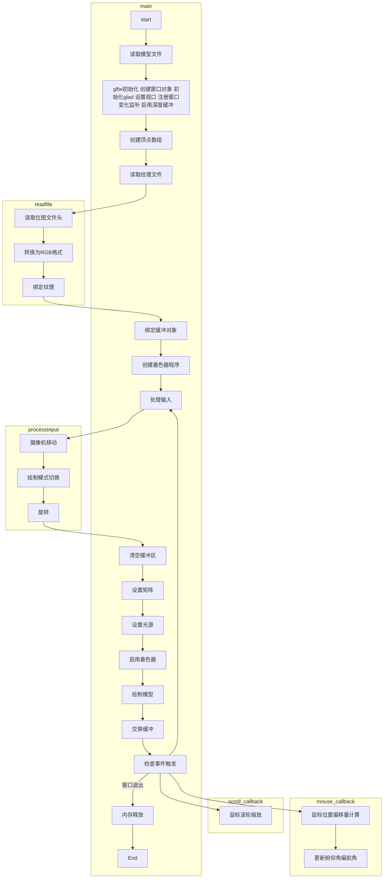
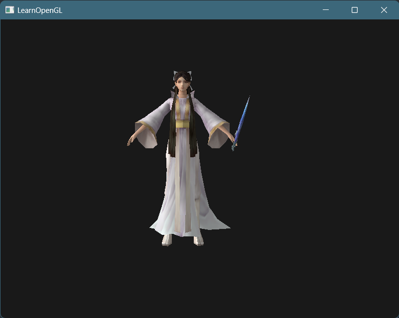
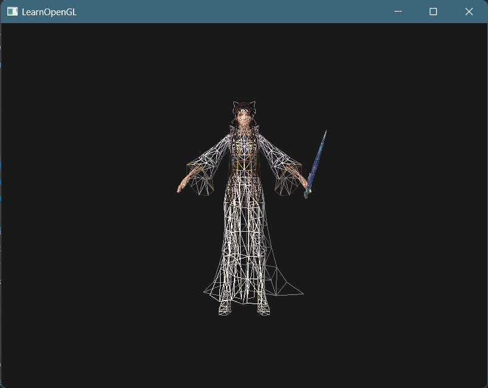
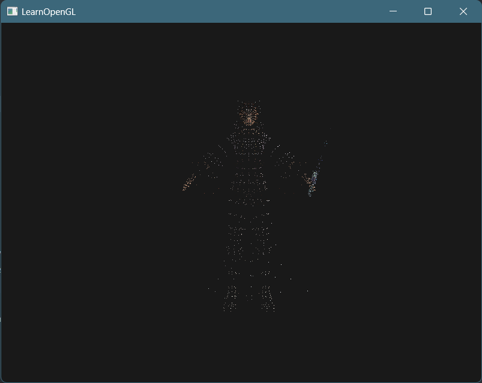
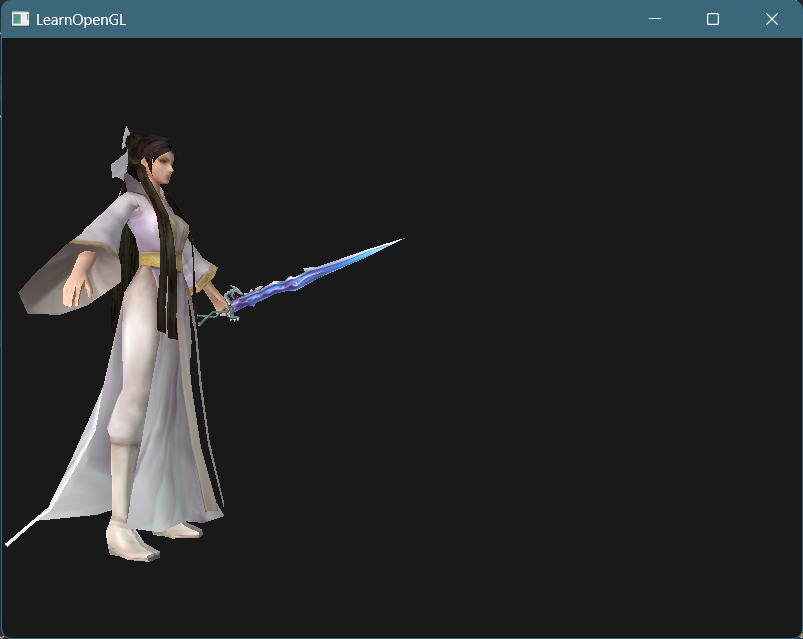
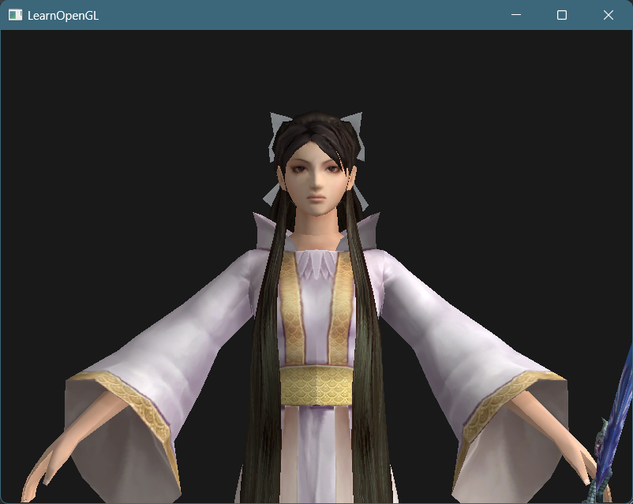
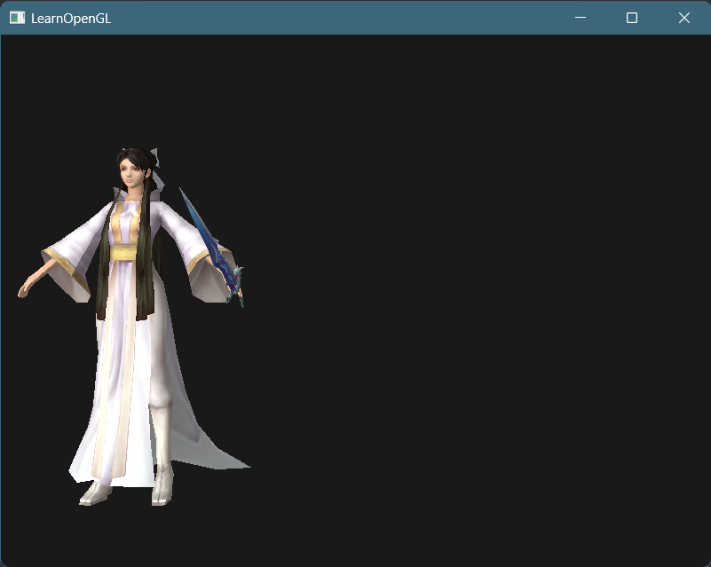
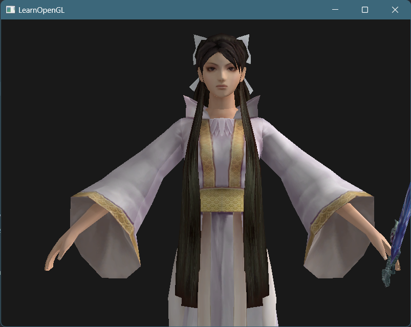
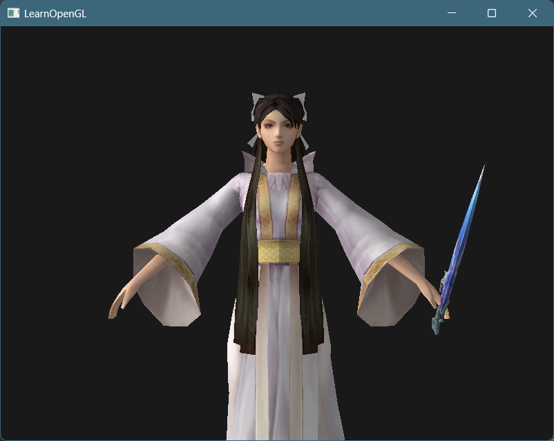
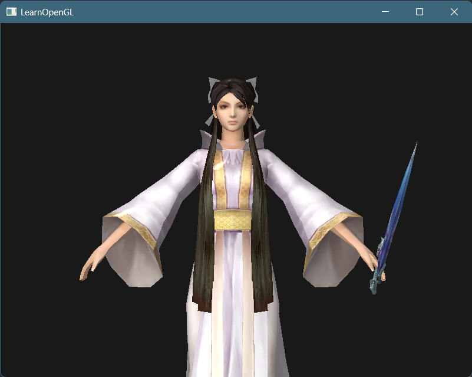

# 实验报告

| 课程名称：计算机图形学理论和应用 | 年级：大三  |
| -------------------------------- | ----------- |
| **指导教师：董兰芳**             | **姓名： ** |
| **实验名称：luweiqi**            | **学号： ** |

## 一、提交文件

353bd50.bmp

9496a70.bmp

9622210.bmp

bd378f0.bmp

light_cube.fs

light_cube.vs

luweiqi.cpp

luweiqi.fs

luweiqi.txt

luweiqi.vs

learnopengl/shader_m.h

learnopengl/camera.h

## 二、实验环境

1. 操作系统：Windows11

2. 编程软件：VSCode Opengl(glad glfw glm)

## 三、实验内容

### 1.实验内容和实现功能

读取luweiqi.rar中的模型文件,显示模型的点,线和面；对三维模型进行旋转、缩放和平移；对三维模型进行纹理贴图；给场景添加光照。

### 2.难点及解决方案

- 纹理文件的读取：纹理文件均为bmp文件，有确定的位图信息头，通过位图信息头获取文件信息后按比特流读取，并将其转换为RGB格式后绑定到纹理上
- 模型的显示：使用glm库，通过设置合适的模型、观察、投影矩阵来改变视角，从而在正面显示模型
- 顶点着色器和片段着色器的配置：在顶点着色器中使用模型、观察、投影矩阵将顶点坐标进行变换，在片段着色器中使用绑定的纹理生成像素
- 显示模型的点线面：在绑定的处理输入的processInput函数中，检测键盘按键，在按键时调用glPolygonMode函数切换绘制模式
- 旋转缩放平移：在绑定的处理输入的processInput函数中，检测键盘按键，在按键时加减模型的旋转角度，并将其应用于模型矩阵中实现旋转效果，在按键时移动摄像机的位置从而实现平移与缩放，也支持通过移动鼠标，在mouse_callback函数中计算俯仰角和偏航角，从而改变观察矩阵，实现旋转效果，也可以用鼠标滚轮来调整缩放比例
- 场景光照添加：在场景中加入一个立方体光源，同时修改顶点着色器向片段着色器传递法向方向与位置，在片段着色器中计算环境光、漫反射光、镜面光、自发光强度，从而产生光照效果

### 3.算法思想

在初始时读取全部模型信息，完成glad的初始化，绑定对应的VAO和VBO缓冲对象，创建着色器程序，在循环中处理鼠标和键盘输入，用以实现模型的点线面显示、平移旋转缩放，设置矩阵，逐个绑定绘制对应的模型。

### 4.实现流程图

<div STYLE="page-break-after: always;"></div>



### 5.关键代码

#### 纹理文件读取

```c++
typedef unsigned long DWORD;
typedef unsigned char BYTE;
typedef unsigned short WORD;
typedef long LONG;

typedef struct tagBITMAPINFOHEADER {
    DWORD biSize;
    LONG biWidth;
    LONG biHeight;
    WORD biPlanes;
    WORD biBitCount;
    DWORD biCompression;
    DWORD biSizeImage;
    LONG biXPelsPerMeter;
    LONG biYPelsPerMeter;
    DWORD biClrUsed;
    DWORD biClrImportant;
} BITMAPINFOHEADER;

    file.open(name, std::ios::binary);
    if (!file.is_open()) {
        exit(-1);
    }
    file.seekg(14, std::ios::beg);                        // 文件头偏移
    file.read((char *)&header, sizeof(BITMAPINFOHEADER)); // 读入位图信息头
    int bytes = header.biBitCount / 8;                    // 每个像素含有的字节数
    // 读取长宽
    int width = std::abs(header.biWidth);
    int height = std::abs(header.biHeight);
    BYTE *pixels = new BYTE[width * height * bytes];
    file.read((char *)pixels, width * height * bytes * sizeof(char)); // 读取位图

    // 将图片转换为RGB格式
    BYTE *data = new BYTE[width * height * 3];
    for (int i = 0; i < width * height; i++) {
        data[i * 3] = pixels[i * bytes + 2];
        data[i * 3 + 1] = pixels[i * bytes + 1];
        data[i * 3 + 2] = pixels[i * bytes];
    }
```

#### 模型显示

```c++
        // 设置矩阵
        glm::mat4 model = glm::mat4(1.0f);
        glm::mat4 view = glm::mat4(1.0f);
        glm::mat4 projection = glm::mat4(1.0f);
        model = glm::rotate(model, glm::radians(270.0f), glm::vec3(1.0f, 0.0f, 0.0f));
        model = glm::rotate(model, rotate * glm::radians(50.0f), glm::vec3(0.0f, 0.0f, 1.0f));
        // model = glm::rotate(model, (float)glfwGetTime() * glm::radians(50.0f), glm::vec3(0.0f, 0.0f, 1.0f));
        view = camera.GetViewMatrix();
        projection = glm::perspective(glm::radians(camera.Zoom), (float)SCR_WIDTH / (float)SCR_HEIGHT, 0.1f, 100.0f);
```

#### 顶点着色器

```c++
#version 330 core
layout (location = 0) in vec3 aPos;
layout (location = 1) in vec2 aTexCoord;
layout (location = 2) in vec3 aNormal;

out vec2 TexCoord;
out vec3 Normal;
out vec3 FragPos;

uniform mat4 model;
uniform mat4 view;
uniform mat4 projection;

void main()
{
    TexCoord = aTexCoord;

    Normal = aNormal;
    
    FragPos = vec3(model * vec4(aPos, 1.0));
    gl_Position = projection * view * vec4(FragPos, 1.0);
}
```

#### 片段着色器(光照)

```c++
#version 330 core

in vec2 TexCoord;
in vec3 Normal;
in vec3 FragPos;

out vec4 FragColor;

struct Material {
    vec3 ambient;
    vec3 diffuse;
    vec3 specular;
    vec3 emission;
    float shininess;
}; 

uniform Material material;

uniform sampler2D ourTexture;
uniform vec3 lightPos; 
uniform vec3 lightColor;
uniform vec3 viewPos;

void main()
{
    vec3 objectColor = vec3(texture(ourTexture, TexCoord));

    // 环境光
    vec3 ambient = lightColor * material.ambient;

    // 漫反射 
    vec3 norm = normalize(Normal);
    vec3 lightDir = normalize(lightPos - FragPos);
    float diff = max(dot(norm, lightDir), 0.0);
    vec3 diffuse = lightColor * (diff * material.diffuse);

    // 镜面光
    vec3 viewDir = normalize(viewPos - FragPos);
    vec3 reflectDir = reflect(-lightDir, norm);  
    float spec = pow(max(dot(viewDir, reflectDir), 0.0), material.shininess);
    vec3 specular = lightColor * (spec * material.specular); 

    // 发光
    vec3 emission = material.emission;

    vec3 result = (ambient + diffuse + specular + emission) * objectColor;

    FragColor = vec4(result, 1.0);
    
}
```

#### 点线面显示

```c++
    // 切换绘制模式
    if (glfwGetKey(window, GLFW_KEY_1) == GLFW_PRESS)
        glPolygonMode(GL_FRONT_AND_BACK, GL_FILL);
    if (glfwGetKey(window, GLFW_KEY_2) == GLFW_PRESS)
        glPolygonMode(GL_FRONT_AND_BACK, GL_LINE);
    if (glfwGetKey(window, GLFW_KEY_3) == GLFW_PRESS)
        glPolygonMode(GL_FRONT_AND_BACK, GL_POINT);
```

#### 旋转缩放平移

```c++
void scroll_callback(GLFWwindow *window, double xoffset, double yoffset) {
    camera.ProcessMouseScroll(yoffset);
}

void mouse_callback(GLFWwindow *window, double xposIn, double yposIn) {
    float xpos = xposIn;
    float ypos = yposIn;

    // 鼠标位置初始化
    if (firstMouse) {
        lastX = xpos;
        lastY = ypos;
        firstMouse = false;
    }

    // 计算鼠标偏移量
    float xoffset = xpos - lastX;
    float yoffset = lastY - ypos;

    // 更新lastX和lastY
    lastX = xpos;
    lastY = ypos;

    // 更新俯仰角和偏航角
    camera.ProcessMouseMovement(xoffset, yoffset);
}
```

```c++
    void ProcessMouseScroll(float yoffset)
    {
        Zoom -= (float)yoffset;
        if (Zoom < 1.0f)
            Zoom = 1.0f;
        if (Zoom > 45.0f)
            Zoom = 45.0f; 
    }
    void ProcessMouseMovement(float xoffset, float yoffset, GLboolean constrainPitch = true)
    {
        xoffset *= MouseSensitivity;
        yoffset *= MouseSensitivity;

        Yaw   += xoffset;
        Pitch += yoffset;

        // make sure that when pitch is out of bounds, screen doesn't get flipped
        if (constrainPitch)
        {
            if (Pitch > 89.0f)
                Pitch = 89.0f;
            if (Pitch < -89.0f)
                Pitch = -89.0f;
        }

        // update Front, Right and Up Vectors using the updated Euler angles
        updateCameraVectors();
    }
```

### 6.运行截图

#### 正面视图



#### 点 线 面

按1 2 3键切换





#### 旋转 缩放 平移

使用q e 键和鼠标可以旋转， 使用w a s d可以平移， 使用鼠标滚轮可以缩放







#### 场景光照







## 四、实验总结

在本次实验中，学习了使用opengl读取模型文件,显示模型的点,线和面；对三维模型进行旋转、缩放和平移；对三维模型进行纹理贴图；给场景添加光照的方法，对现代opengl的核心模式有了深入的理解。
