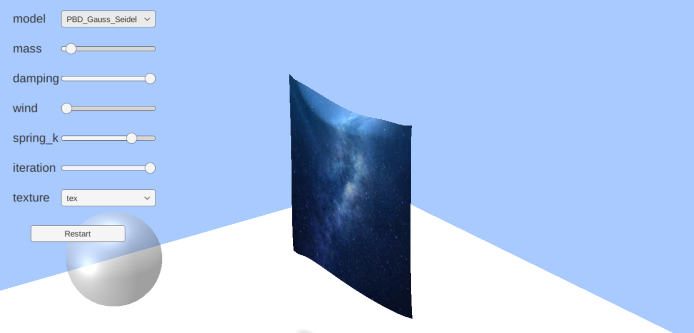
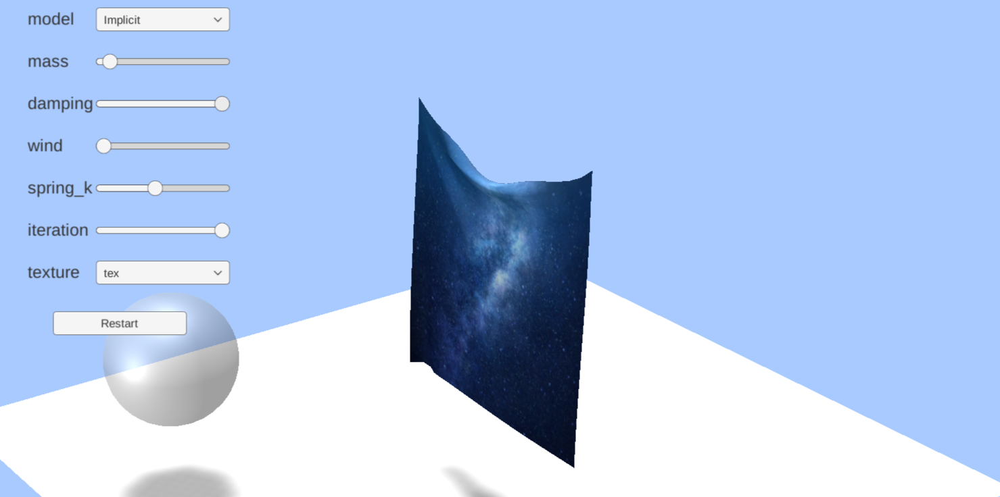

# 实验报告

| 课程名称：计算机图形学理论和应用 | 年级：大三  |
| -------------------------------- | ----------- |
| **指导教师：董兰芳**             | **姓名： ** |
| **实验名称：布料仿真**           | **学号： ** |

## 一、提交文件

Cloth Simulation

│  .vsconfig
│  Assembly-CSharp.csproj
│  Cloth Simulation.sln
│
├─Assets
│  │  Materials.meta
│  │  Scenes.meta
│  │  Scripts.meta
│  │  Shaders.meta
│  │
│  ├─Materials
│  │      ClothMaterialCPU.mat
│  │      ClothMaterialCPU.mat.meta
│  │      ClothMaterialGPU.mat
│  │      ClothMaterialGPU.mat.meta
│  │      SphereMaterila.mat
│  │      SphereMaterila.mat.meta
│  │
│  ├─Scenes
│  │      CPU.unity
│  │      CPU.unity.meta
│  │      GPU.unity
│  │      GPU.unity.meta
│  │
│  ├─Scripts
│  │      CameraMotion.cs
│  │      CameraMotion.cs.meta
│  │      CPUModel.cs
│  │      CPUModel.cs.meta
│  │      GPUModel.cs
│  │      GPUModel.cs.meta
│  │      SphereMotion.cs
│  │      SphereMotion.cs.meta
│  │
│  └─Shaders
│          ClothComputeShader.compute
│          ClothComputeShader.compute.meta
│          ClothShaderCPU.shader
│          ClothShaderCPU.shader.meta
│          ClothShaderGPU.shader
│          ClothShaderGPU.shader.meta
│          image.jpg
│          image.jpg.meta
│
├─Packages
│      manifest.json
│      packages-lock.json
│
├─ProjectSettings
│      AudioManager.asset
│      ClusterInputManager.asset
│      DynamicsManager.asset
│      EditorBuildSettings.asset
│      EditorSettings.asset
│      GraphicsSettings.asset
│      InputManager.asset
│      NavMeshAreas.asset
│      PackageManagerSettings.asset
│      Physics2DSettings.asset
│      PresetManager.asset
│      ProjectSettings.asset
│      ProjectVersion.txt
│      QualitySettings.asset
│      SceneTemplateSettings.json
│      TagManager.asset
│      TimeManager.asset
│      UnityConnectSettings.asset
│      VersionControlSettings.asset
│      VFXManager.asset
│      XRSettings.asset
│
└─UserSettings
        EditorUserSettings.asset
        Search.settings

## 二、实验环境

1. 操作系统：Windows11

2. 编程软件：Unity2021.1.7f1c1

## 三、实验内容

### 1.实验内容和实现功能

​	布料仿真：

- 布料解算的GPU与CPU实现（Explicit, PBD_Gauss_Seidel, PBD_Jacobi, PBD_SOR, XPBD, Implicit, Implicit_Chebyshev）
- 布料碰撞
- 布料光照
- 视角平移旋转缩放
- 布料的贴图
- 布料的加速度显示
- 布料的内应力显示
- 布料参数调节
- 布料与鼠标交互

### 2.难点及解决方案

- 布料解算：

  使用了七种方法实现布料解算

  Explicit：显式欧拉法

  PBD_Gauss_Seidel：使用Gauss_Seidel迭代的PBD方法

  PBD_Jacobi：使用Jacobi迭代的PBD方法

  PBD_SOR：使用SOR迭代的PBD方法

  XPBD：XPBD方法（PBD的改进）

  Implicit：隐式欧拉法

  Implicit_Chebyshev：使用Chebyshev半迭代法加速的隐式欧拉法

  其中Explicit实现了CPU与GPU版本，其它方法均实现CPU版本

- 布料碰撞：实现了布料与外界球体的碰撞，在碰撞时（布料的质点在球体内部）向布料施加脉冲力 $f= 1 / t * d$ ，其中d为质点距球体表面的距离

- 布料光照：使用DirectX 11 API中的shader实现光照与阴影效果

- 视角平移旋转缩放：检测键盘与鼠标输入，进行摄像机的移动与视角变换

- GPU并行化：使用DirectX 11 API Compute Shader实现并行计算

- 参数调节：使用Unity的Dropdown和Slider组件实现

### 3.算法思想

​	布料在发生形变时，需要考虑系统内部的相对影响，通过弹簧可以模拟布料形变时产生的弹性势能。首先将布料用网格表示，给网格的顶点一定的质量，通过弹簧将网格的顶点相连构成弹簧质点系统。


​	在不考虑非保守力的作用下，系统中质点的位置可以唯一地确定系统的状态。利用牛顿第二定律：

$$
\begin{equation}
	x''=M^{-1}(\frac{\partial E}{\partial x})
\end{equation}
$$

​	在存在非保守力时：

$$
\begin{equation}
	x''=M^{-1}(\frac{\partial E}{\partial x}+F)
\end{equation}
$$

​	在弹簧质点系统中，根据胡克定律(Hooke's law)：

$$
\begin{equation}
	\begin{split}
		&F_{spring}=-k_s\Delta x \\
		&F_{s_i}=k_s(1-\frac{L}{\left \| x_i-x_j \right \| })(x_i-x_j)
	\end{split}
\end{equation}
$$

​	除此之外还可以加入重力、空气阻力、弹簧阻尼等其它作用力。

​	在模拟系统随时间的演化时，求解(2)式得到：

$$
\begin{equation}
	x = \iint M^{-1}(\frac{\partial E}{\partial x}+F)dtdt=\iint adtdt
\end{equation}
$$

#### Explicit：显式欧拉法

​	在实际的模拟中，时间是离散的，因此需要做数值积分。直接的方法是显式欧拉方法(explicit Euler method)：

$$
\begin{equation}
	\begin{split}
		v(i+1) = v(i) + a(i)\Delta t \\
		x(i+1) = x(i) + v(i)\Delta t
	\end{split}
\end{equation}
$$

​	此时下一时刻的速度和位移完全由上一时刻决定，导致当 $\Delta t$ 较大时计算结果不稳定。

#### Implicit：隐式欧拉法

​	另一种方法是隐式欧拉方法(implicit Euler method)：

$$
\begin{equation}
		\begin{split}
			v(i+1) = v(i) + a(i+1)\Delta t \\
			x(i+1) = x(i) + v(i+1)\Delta t
		\end{split}
\end{equation}
$$

​	由于加速度也是位置的函数，此时需要解方程得出下一时刻的速度，它的误差比显式欧拉方法小一些。

​	在隐式欧拉方法中，将速度方程代入位置方程可以得到：

$$
\begin{equation}
		\begin{split}
			x(i+1) &= x(i) + (v(i) + a(i+1)\Delta t)\Delta t\\
				&= x(i) + v(i)\Delta t + a(i+1)(\Delta t)^2\\
				&= x(i) + v(i)\Delta t + M^{-1}f(i+1)(\Delta t)^2
		\end{split}
\end{equation}
$$

$$
\begin{equation}
	\frac{M}{(\Delta t)^2}(x(i+1)-x(i)-v(i)\Delta t) - f(i+1)=0
\end{equation}
$$

​		在不考虑非保守力时，可以构造一个优化问题，使 $x(i+1)$ 为这个优化问题的解，从而利用求解优化问题的方法求解数值积分：

$$
\begin{equation}
​		\begin{split}
​			&F(x)=\frac{1}{2(\Delta t)^2}(x-\bar x)^TM(x-\bar x)+E(x)\\
​			&\bar x=x(i)+v(i)\Delta t\\
​			&x(i+1) = \mathop{argmin}\limits_xF(x)
​		\end{split}
\end{equation}
$$

​		求解式(8)等价于求解 $F(x)$ 的导数为0的点，从而转化为求解 $F(x)$ 的极值。

​		为了求解这个优化问题，可以使用牛顿法，利用下面的公式进行迭代直到收敛：

$$
\begin{equation}
​			x^{k+1} = x^{k}-(\nabla ^2F(x))^{-1}\nabla F(x)
\end{equation}
$$


​		初始的 $x^0=x(i)$ ，最终收敛的 $x^{k}=x(i+1)$ 

#### Implicit_Chebyshev：使用Chebyshev半迭代法加速的隐式欧拉法

​	(2015)A Chebyshev Semi-Iterative Approach for Accelerating Projective and Position-based Dynamics


​	

​	基于位置的动力学方法(PBD)的算法流程如下

​	

​	每次迭代时，首先根据外力算出此时的速度更新，然后让速度根据阻尼衰减，再根据速度得到位移的变化量，通过位移生成碰撞约束，之后在位移的基础上对约束条件进行迭代直到收敛，再根据位移变化得出最终的速度。

​	其中算法的核心是在位移的基础上对约束条件进行迭代直到收敛，这里将之前得到的预估位移投影到约束条件上从而得到最终位移。

​	假设有一个n维约束：

$$
\begin{equation}
\begin{split}
	&\pmb{p} = [\pmb{p_1},…,\pmb{p_n}]\\
	&C(\pmb{p}) = 0
\end{split}
\end{equation}
$$

​	现在需要找到偏移量 $\Delta \pmb{p}$ ，使得投影前的 $\pmb{p}$ 在偏移后满足约束：

$$
\begin{equation}
	C(\pmb{p}+\Delta \pmb{p})=0
\end{equation}
$$

​	对约束函数在 $\pmb{p}$ 处进行展开：

$$
\begin{equation}
	C(\pmb{p}+\Delta \pmb{p}) = C(\pmb{p}) + \nabla_pC(\pmb{p}) \cdot \Delta \pmb{p} +o(\Delta \pmb{p}) =0
\end{equation}
$$

​	将 $\Delta \pmb{p}$ 限定在 $\nabla_pC(\pmb{p})$ 的方向上可以保持动量、角动量守恒：

$$
\begin{equation}
	\Delta \pmb{p} = \lambda \nabla_pC(\pmb{p})
\end{equation}
$$

​	联立可得：

$$
\begin{equation}
	\Delta \pmb{p} = -\frac{C(\pmb{p})}{\left | \nabla_pC(\pmb{p}) \right | ^2}\nabla_pC(\pmb{p})
\end{equation}
$$

​	对于单个质点来说：

$$
\begin{equation}
\Delta \pmb{p_i} = -\frac{C(\pmb{p})}{\sum_{j} \left | \nabla_{p_j}C(\pmb{p}) \right | ^2}\nabla	_{p_i}C(\pmb{p})
\end{equation}
$$

​	考虑到质点的 $\Delta \pmb{p_i}$ 应与质量的倒数 $\omega_i=\frac{1}{m_i}$ 成反比

$$
\begin{equation}
\pmb{p_i} = -\frac{C(\pmb{p})}{\sum_{j} \omega_j\left | \nabla_{p_j}C(\pmb{p}) \right | ^2}\omega_i\nabla_{p_i}C(\pmb{p})
\end{equation}
$$

​	对于布料，两个质点之间的距离约束可以表述为：

$$
\begin{equation}
	C(\pmb{p_1},\pmb{p_2})=\left | \pmb{p_1}-\pmb{p_2} \right |-L
\end{equation}
$$

​	梯度为：

$$
\begin{equation}
\begin{split}
	&\nabla_{p_1}C(\pmb{p_1},\pmb{p_2})=\frac{\pmb{p_1}-\pmb{p_2}}{\left | \pmb{p_1}-\pmb{p_2} \right |}\\
	&\frac{C(\pmb{p})}{\sum_{j} \omega_j\left | \nabla_{p_j}C(\pmb{p}) \right | ^2} = \frac{\left | \pmb{p_1}-\pmb{p_2} \right |-L}{2}
\end{split}
\end{equation}
$$

​	约束投影后的偏移为：

$$
\begin{equation}
\Delta \pmb{p_1} =-\frac{1}{2}(\left | \pmb{p_1}-\pmb{p_2} \right |-L)\frac{\pmb{p_1}-\pmb{p_2}}{\left | \pmb{p_1}-\pmb{p_2} \right |}
\end{equation}
$$

​	以下为两种迭代的方法：

#### PBD_Gauss_Seidel：使用Gauss_Seidel迭代的PBD方法

​	其中Gauss-Seidel遍历全部约束，难以进行并行。


#### PBD_Jacobi：使用Jacobi迭代的PBD方法

​	Jacobi方法在遍历全部约束后统一更新。


​	对于两个约束Ci和Cj，Gauss-Seidel和Jacobi方法的直观对比如下


#### PBD_SOR：使用SOR迭代的PBD方法	

​	(2014)Unified Particle Physics for Real-Time Applications

​	为了解决Gauss-Seidel方法不能并行的问题，可以先并行地处理每个约束，在迭代结束时将它们的均值作为最终的结果，并引入一个全局参数控制SOR的速率：

$$
\begin{equation}
	\Delta\tilde{\bf x}_{i}=\frac{\omega}{n_{i}}\Delta{\bf x}_{i}
\end{equation}
$$

​	它不能保证动量守恒，但一般视觉误差并不明显。

​	PBD方法实际上是把弹簧质点系统中的弹力变为了约束，系统的刚度取决于迭代的次数，迭代次数越多时约束越强，系统的刚度也就越大，然而很难得到一个物体的力学性质和迭代次数的关系。拉法相比，PBD优化的目标是 $E(x)$ ，这使得它忽略了惯性项 $\frac{1}{2(\Delta t)^2}(x-\bar x)^TM(x-\bar x)$ ，同时它不是基于物理推导出来的，不符合物理规律。

#### XPBD：XPBD方法（PBD的改进）

​	(2016)XPBD Position-Based Simulation of Compliant Constrained Dynamics

​		PBD算法中时间步长和迭代次数决定了物体的刚性，在复杂的系统中，由于参数之间的耦合，难以单独改变一个物体的刚性。在这篇文章中，提出了拓展的PBD算法（XPBD），显式引入弹性势能，从而通过弹性势能来确定物体刚性。

​	弹性势能场为：

$$
\begin{equation}
	U({\bf x})={\frac{1}{2}}{\bf C}({\bf x})^{T}\alpha^{-1}{\bf C}({\bf x})
\end{equation}
$$

​	由此所产生的弹性力为：

$$
\begin{equation}
	\mathbf{f}_{e l a s t i c}=-\nabla_{\mathbf{x}}U^{T}=-\nabla\mathbf{C}^{T}\alpha^{-1}\mathbf{C}
\end{equation}
$$

​	引入拉格朗日乘子将其分解得到：

$$
\begin{equation}
	\lambda_{e l a s t i c}=-\tilde{\alpha}^{-1}{\bf C}({\bf x})
\end{equation}
$$

​	其中 $\widetilde{\alpha}=\frac{\alpha}{(\Delta t)^2}$ 
​	得到离散的运动方程：

$$
\begin{equation}
	\begin{split}
		&\mathrm{M}({\bf x}^{n+1}-\tilde{\bf x})-\nabla{\bf C}({\bf x}^{n+1})^{T}\lambda^{n+1}=\mathrm{O}\\ 
		&{\mathbf C}({\mathbf x}^{n+1})+\widetilde{\alpha}\lambda^{n+1}={\mathbf0}
	\end{split}
\end{equation}
$$

​	将两式分别记为g和h，需要找到x和 $\lambda$ 满足：

$$
\begin{equation}
	\begin{split}
		&\mathbf{g}(\mathbf{x},\lambda)=\mathbf{0}\\ 
		&\mathbf{h}(\mathbf{x},\lambda)=\mathbf{0}
	\end{split}
\end{equation}
$$

​	得到以下线性牛顿子问题：

$$
\begin{equation}
	\left[\begin{array}{cc}
	\mathbf{K} & -\nabla \mathbf{C}^{T}\left(\mathbf{x}_{i}\right) \\
	\nabla \mathbf{C}\left(\mathbf{x}_{i}\right) & \tilde{\boldsymbol{\alpha}}
	\end{array}\right]\left[\begin{array}{l}
	\Delta \mathbf{x} \\
	\Delta \boldsymbol{\lambda}
	\end{array}\right]=-\left[\begin{array}{l}
	\mathbf{g}\left(\mathbf{x}_{i}, \boldsymbol{\lambda}_{i}\right) \\
	\mathbf{h}\left(\mathbf{x}_{i}, \boldsymbol{\lambda}_{i}\right)
	\end{array}\right]
\end{equation}
$$

​	现在使用两个近似方法以简化计算的实现，假设 $\mathbf{K} \approx \mathbf{M}$ ，并且 $\mathbf{g}\left(x_{i}, \boldsymbol{\lambda}_{i}\right) \approx 0$

$$
\begin{equation}
	\left[\begin{array}{cc}
	\mathbf{M} & -\nabla \mathbf{C}^{T}\left(\mathbf{x}_{i}\right) \\
	\nabla \mathbf{C}\left(\mathbf{x}_{i}\right) & \tilde{\boldsymbol{\alpha}}
	\end{array}\right]\left[\begin{array}{l}
	\Delta \mathbf{x} \\
	\Delta \boldsymbol{\lambda}
	\end{array}\right]=-\left[\begin{array}{l}
	0 \\
	\mathbf{h}\left(\mathbf{x}_{i}, \boldsymbol{\lambda}_{i}\right)
	\end{array}\right]
	\end{equation}
$$

​	最终得到新的迭代方程：

$$
\begin{equation}
	\begin{split}
		\Delta{\bf x}={\bf M}^{-1}\nabla\mathrm{C}({\bf x}_{i})^{T}\Delta\lambda \\
		\Delta\lambda_{j}=\frac{-C_{j}({\bf x}_{i})-\bar{\alpha}_{j}\lambda_{i j}}{\nabla C_{j}\mathrm{M}^{-1}\nabla C_{j}^{T}+\tilde{\alpha}_{j}}
	\end{split}
\end{equation}
$$

​	XPBD的算法流程如下

​	

<div STYLE="page-break-after: always;"></div>

### 4.实现流程图


### 5.关键代码

#### CPUModel

##### Start

使用unity的mesh组件，进行初始化工作，构建顶点表和边表

```c++
    void Start()
    {
        material = gameObject.GetComponent<MeshRenderer>().material;
        Mesh mesh = GetComponent<MeshFilter>().mesh;

        //Resize the mesh.
        X = new Vector3[n * n];
        UV_tex = new Vector2[n * n];
        int[] triangles = new int[(n - 1) * (n - 1) * 6];
        for (int j = 0; j < n; j++)
            for (int i = 0; i < n; i++)
            {
                X[j * n + i] = new Vector3(5 - 10.0f * i / (n - 1), 0, 5 - 10.0f * j / (n - 1));
                UV_tex[j * n + i] = new Vector3(i / (n - 1.0f), j / (n - 1.0f));
            }
        int t = 0;
        for (int j = 0; j < n - 1; j++)
            for (int i = 0; i < n - 1; i++)
            {
                triangles[t * 6 + 0] = j * n + i;
                triangles[t * 6 + 1] = j * n + i + 1;
                triangles[t * 6 + 2] = (j + 1) * n + i + 1;
                triangles[t * 6 + 3] = j * n + i;
                triangles[t * 6 + 4] = (j + 1) * n + i + 1;
                triangles[t * 6 + 5] = (j + 1) * n + i;
                t++;
            }
        mesh.vertices = X;
        mesh.triangles = triangles;
        mesh.uv = UV_tex;
        mesh.RecalculateNormals();


        //Construct the original E
        int[] _E = new int[triangles.Length * 2];
        for (int i = 0; i < triangles.Length; i += 3)
        {
            _E[i * 2 + 0] = triangles[i + 0];
            _E[i * 2 + 1] = triangles[i + 1];
            _E[i * 2 + 2] = triangles[i + 1];
            _E[i * 2 + 3] = triangles[i + 2];
            _E[i * 2 + 4] = triangles[i + 2];
            _E[i * 2 + 5] = triangles[i + 0];
        }
        //Reorder the original edge list
        for (int i = 0; i < _E.Length; i += 2)
            if (_E[i] > _E[i + 1])
                Swap(ref _E[i], ref _E[i + 1]);
        //Sort the original edge list using quicksort
        Quick_Sort(ref _E, 0, _E.Length / 2 - 1);

        int e_number = 0;
        for (int i = 0; i < _E.Length; i += 2)
            if (i == 0 || _E[i + 0] != _E[i - 2] || _E[i + 1] != _E[i - 1])
                e_number++;

        E = new int[e_number * 2];
        for (int i = 0, e = 0; i < _E.Length; i += 2)
            if (i == 0 || _E[i + 0] != _E[i - 2] || _E[i + 1] != _E[i - 1])
            {
                E[e * 2 + 0] = _E[i + 0];
                E[e * 2 + 1] = _E[i + 1];
                e++;
            }

        L = new float[E.Length / 2];
        for (int e = 0; e < E.Length / 2; e++)
        {
            int v0 = E[e * 2 + 0];
            int v1 = E[e * 2 + 1];
            L[e] = (X[v0] - X[v1]).magnitude;
        }

        V = new Vector3[X.Length];
        for (int i = 0; i < V.Length; i++)
            V[i] = new Vector3(0, 0, 0);
    }

    void Quick_Sort(ref int[] a, int l, int r)
    {
        int j;
        if (l < r)
        {
            j = Quick_Sort_Partition(ref a, l, r);
            Quick_Sort(ref a, l, j - 1);
            Quick_Sort(ref a, j + 1, r);
        }
    }

    int Quick_Sort_Partition(ref int[] a, int l, int r)
    {
        int pivot_0, pivot_1, i, j;
        pivot_0 = a[l * 2 + 0];
        pivot_1 = a[l * 2 + 1];
        i = l;
        j = r + 1;
        while (true)
        {
            do ++i; while (i <= r && (a[i * 2] < pivot_0 || a[i * 2] == pivot_0 && a[i * 2 + 1] <= pivot_1));
            do --j; while (a[j * 2] > pivot_0 || a[j * 2] == pivot_0 && a[j * 2 + 1] > pivot_1);
            if (i >= j) break;
            Swap(ref a[i * 2], ref a[j * 2]);
            Swap(ref a[i * 2 + 1], ref a[j * 2 + 1]);
        }
        Swap(ref a[l * 2 + 0], ref a[j * 2 + 0]);
        Swap(ref a[l * 2 + 1], ref a[j * 2 + 1]);
        return j;
    }

    void Swap(ref int a, ref int b)
    {
        int temp = a;
        a = b;
        b = temp;
    }
```

##### Collision_Handling

碰撞检测与处理

```c++
void Collision_Handling()
{
    Mesh mesh = GetComponent<MeshFilter>().mesh;
    X = mesh.vertices;

    //Handle colllision.
    GameObject sphere = GameObject.Find("Sphere");
    Vector3 center = sphere.transform.position;
    float d;
    for (int i = 0; i < X.Length; i++)
    {
        if (point_move && i == point_index) continue;
        if (i == 0 || i == 20) continue;
        Vector3 v = X[i] - center;
        d = v.magnitude;
        if (d < r)
        {
            V[i] += 1 / t * (r * v / d - v);
            X[i] = center + r * v / d;
        }
    }
    mesh.vertices = X;
}
```

##### Strain_Limiting

PBD_Gauss_Seidel, PBD_Jacobi, PBD_SOR, XPBD四种方法使用的约束投影

```c++
void Strain_Limiting()
{
    Mesh mesh = GetComponent<MeshFilter>().mesh;
    Vector3[] vertices = mesh.vertices;

    if (model_type == model.PBD_Gauss_Seidel)
    {
        Vector3[] vertices_last = mesh.vertices;
        for (int e = 0; e < E.Length / 2; e++)
        {
            int i = E[e * 2 + 0];
            int j = E[e * 2 + 1];
            Vector3 deltaL = vertices[i] - vertices[j];
            vertices[i] -= 0.5f * (deltaL - L[e] * deltaL / deltaL.magnitude);
            vertices[j] += 0.5f * (deltaL - L[e] * deltaL / deltaL.magnitude);
        }
        for (int i = 0; i < vertices.Length; i++)
        {
            if (point_move && i == point_index) vertices[i] = vertices_last[i];
            if (i == 0 || i == 20) vertices[i] = vertices_last[i];
            V[i] += 1 / t * (vertices[i] - vertices_last[i]);
        }
    }
    else if (model_type == model.PBD_Jacobi || model_type == model.PBD_SOR)
    {
        //Apply PBD here.
        Vector3[] sum_x = new Vector3[vertices.Length];
        int[] sum_n = new int[vertices.Length];

        for (int i = 0; i < vertices.Length; i++)
        {
            sum_x[i] = new Vector3(0, 0, 0);
            sum_n[i] = 0;
        }

        for (int e = 0; e < E.Length / 2; e++)
        {
            int i = E[e * 2 + 0];
            int j = E[e * 2 + 1];
            Vector3 deltaL = vertices[i] - vertices[j];
            sum_x[i] += 0.5f * (vertices[i] + vertices[j] + L[e] * deltaL / deltaL.magnitude);
            sum_n[i] += 1;
            sum_x[j] += 0.5f * (vertices[i] + vertices[j] - L[e] * deltaL / deltaL.magnitude);
            sum_n[j] += 1;
        }

        for (int i = 0; i < vertices.Length; i++)
        {
            if (point_move && i == point_index) continue;
            if (i == 0 || i == 20) continue;
            V[i] += 1 / t * ((0.2f * vertices[i] + sum_x[i]) / (0.2f + sum_n[i]) - vertices[i]);
            if (model_type == model.PBD_Jacobi)
                vertices[i] = (0.2f * vertices[i] + sum_x[i]) / (0.2f + sum_n[i]);
            else
                vertices[i] = 0.5f * vertices[i] + 0.5f * sum_x[i] / sum_n[i];
        }
    }
    else
    {
        Vector3[] vertices_last = mesh.vertices;

        for (int e = 0; e < E.Length / 2; e++)
        {
            int i = E[e * 2 + 0];
            int j = E[e * 2 + 1];
            Vector3 deltaL = vertices[i] - vertices[j];
            float deltalambda = (deltaL.magnitude - L[e] + spring_k / 8000 * lambda[e]) / (2 + spring_k / 8000);
            lambda[e] += deltalambda;
            vertices[i] -= deltalambda * deltaL / deltaL.magnitude;
            vertices[j] += deltalambda * deltaL / deltaL.magnitude;
        }

        for (int i = 0; i < vertices.Length; i++)
        {
            if (point_move && i == point_index) vertices[i] = vertices_last[i];
            if (i == 0 || i == 20) vertices[i] = vertices_last[i];
            V[i] += 1 / t * (vertices[i] - vertices_last[i]);
        }
    }

    mesh.vertices = vertices;
}
```

##### Get_Gradient

计算Implicit, Implicit_Chebyshev所需的梯度

```c++
void Get_Gradient(Vector3[] X, Vector3[] X_hat, float t, Vector3[] G)
{
    for (int i = 0; i < X.Length; i++)
    {
        G[i] = 1 / (t * t) * mass * (X[i] - X_hat[i]);
    }
    //Momentum and Gravity.
    for (int i = 0; i < X.Length; i++)
    {
        G[i] -= gravity * mass;
    }
    //Spring Force.
    for (int e = 0; e < E.Length / 2; e++)
    {
        int i = E[e * 2 + 0];
        int j = E[e * 2 + 1];
        Vector3 deltaL = X[i] - X[j];
        if (deltaL.magnitude == 0)
            continue;
        G[i] += spring_k * (1 - L[e] / deltaL.magnitude) * deltaL;
        G[j] -= spring_k * (1 - L[e] / deltaL.magnitude) * deltaL;
    }
}
```

##### Explicit

显式欧拉法的求解

```c++
        for (int i = 0; i < X.Length; i++)
        {
            if (point_move && i == point_index) continue;
            if (i == 0 || i == 20) continue;
            V[i] += t / iteration * gravity;
        }
        for (int k = 0; k < iteration; k++)
        {
            for (int i = 0; i < X.Length; i++)
            {
                if (point_move && i == point_index) continue;
                if (i == 0 || i == 20) continue;
                V[i] += t / iteration * gravity * mass;
                if (wind > 0)
                    V[i] += wind * (Vector3.Dot(mesh.normals[i], new Vector3(0, 0, wind) - V[i])) * mesh.normals[i] * t / iteration;
            }
            for (int e = 0; e < E.Length / 2; e++)
            {
                int i = E[e * 2 + 0];
                int j = E[e * 2 + 1];
                Vector3 deltaL = X[i] - X[j];
                if (deltaL.magnitude == 0)
                    continue;
                V[i] -= t / iteration * spring_k * (1 - L[e] / deltaL.magnitude) * deltaL;
                V[j] += t / iteration * spring_k * (1 - L[e] / deltaL.magnitude) * deltaL;
            }
            for (int i = 0; i < X.Length; i++)
            {
                if (point_move && i == point_index) continue;
                if (i == 0 || i == 20) continue;
                X[i] += t / iteration * V[i];
            }
        }
        mesh.vertices = X;
```

##### PBD

PBD_Gauss_Seidel、PBD_Jacobi、PBD_SOR、XPBD的求解

```c++
        if (model_type == model.XPBD)
        {
            lambda = new float[E.Length / 2];
        }
        for (int i = 0; i < X.Length; i++)
        {
            if (point_move && i == point_index) continue;
            if (i == 0 || i == 20) continue;
            V[i] = V[i] * damping;
            V[i] += t * gravity * mass;
            if (wind > 0)
                V[i] += wind * (Vector3.Dot(mesh.normals[i], new Vector3(0, 0, wind) - V[i])) * mesh.normals[i] * t;
            X[i] += t * V[i];
        }
        mesh.vertices = X;

        for (int k = 0; k < iteration; k++)
            Strain_Limiting();
```

##### Implicit

隐式欧拉法的求解

```c++
        Vector3[] X_hat = new Vector3[X.Length];
        Vector3[] G = new Vector3[X.Length];

        for (int i = 0; i < V.Length; i++)
        {
            if (point_move && i == point_index) continue;
            if (i == 0 || i == 20) continue;
            V[i] *= damping;
            if (wind > 0)
                V[i] += wind * (Vector3.Dot(mesh.normals[i], new Vector3(0, 0, wind) - V[i])) * mesh.normals[i] * t;
        }
        for (int i = 0; i < X.Length; i++)
        {
            X_hat[i] = X[i] + t * V[i];
            X[i] = X_hat[i];
        }

        float d = 1 / (1 / (t * t) * mass + 4 * spring_k);
        for (int k = 0; k < iteration; k++)
        {
            Get_Gradient(X, X_hat, t, G);
            for (int i = 0; i < X.Length; i++)
            {
                if (point_move && i == point_index) continue;
                if (i == 0 || i == 20) continue;
                X[i] -= d * G[i];
            }
        }

        for (int i = 0; i < X.Length; i++)
        {
            if (point_move && i == point_index) continue;
            if (i == 0 || i == 20) continue;
            V[i] += 1 / t * (X[i] - X_hat[i]);
        }

        mesh.vertices = X;
```

##### Implicit_Chebyshev

使用Chebyshev半迭代法加速的隐式欧拉法的求解

```c++
        Vector3[] X_hat = new Vector3[X.Length];
        Vector3[] G = new Vector3[X.Length];
        Vector3[] last_X = new Vector3[X.Length];
        float w = 1;
        float rho = 0.7f;

        for (int i = 0; i < V.Length; i++)
        {
            if (point_move && i == point_index) continue;
            if (i == 0 || i == 20) continue;
            V[i] *= damping;
            if (wind > 0)
                V[i] += wind * (Vector3.Dot(mesh.normals[i], new Vector3(0, 0, wind) - V[i])) * mesh.normals[i] * t;
        }
        for (int i = 0; i < X.Length; i++)
        {
            X_hat[i] = X[i] + t * V[i];
            X[i] = X_hat[i];
            last_X[i] = new Vector3(0, 0, 0);
        }

        for (int k = 0; k < iteration; k++)
        {
            if (k == 0)
            {
                w = 1;
            }
            else if (k == 1)
            {
                w = 2 / (2 - rho * rho);
            }
            else
            {
                w = 4 / (4 - rho * rho * w);
            }
            Get_Gradient(X, X_hat, t, G);
            for (int i = 0; i < X.Length; i++)
            {
                if (point_move && i == point_index) continue;
                if (i == 0 || i == 20) continue;
                Vector3 old_X = X[i];
                X[i] -= 1 / (1 / (t * t) * mass + 4 * spring_k) * G[i];
                X[i] = w * X[i] + (1 - w) * last_X[i];
                last_X[i] = old_X;
            }
        }

        for (int i = 0; i < X.Length; i++)
        {
            if (point_move && i == point_index) continue;
            if (i == 0 || i == 20) continue;
            V[i] += 1 / t * (X[i] - X_hat[i]);
        }

        mesh.vertices = X;
```

##### shader

纹理贴图与光照阴影处理

```c++
Shader "Custom/ClothShaderCPU" {
	Properties{
		_MainTex("Base (RGB)", 2D) = "white" {}
		[Enum(tex,0,force,1,stress,2)]_Texture("Texture",Float) = 0
	}
		SubShader{
			Cull Off
			Tags { "RenderType" = "Opaque" }
			LOD 200

			CGPROGRAM
			#pragma surface surf Standard fullforwardshadows

			fixed3 HSVToRGB(fixed3 c)
			{
				float4 K = float4(1.0, 2.0 / 3.0, 1.0 / 3.0, 3.0);
				fixed3 p = abs(frac(c.xxx + K.xyz) * 6.0 - K.www);
				return c.z * lerp(K.xxx, saturate(p - K.xxx), c.y);
			}

			sampler2D _MainTex;
			float _Texture;

			struct Input {
				float2 uv_MainTex;
			};

			void surf(Input IN, inout SurfaceOutputStandard o) {
				if (_Texture == 0) {
					half4 c = tex2D(_MainTex, IN.uv_MainTex);
					o.Albedo = c.rgb;
					o.Alpha = 0;
				}
				else
				{
					float force = force = IN.uv_MainTex.x;
					if (_Texture == 2)
						force = force / 1000;
					fixed4 c = fixed4(HSVToRGB(fixed3(0.5 + force, 1, 1)), 1);
					o.Albedo = c.rgb;
					o.Alpha = 0;
				}
			}
			ENDCG
		}
			FallBack "Diffuse"
}
```

#### GPUModel

##### Compute Shader

gpu并行进行位置、速度更新、碰撞检测

```c++
static float3 getSpring(float3 p, float3 q, uint type) {
	float3 w = p - q;
	return w * springk * (springlength[type] * rcp(length(w)) - 1);
}

static bool isvalidateid(uint3 id) {
	return id.x >= 0 && id.x < vertexnum&& id.y >= 0 && id.y < vertexnum;
}

static float3 getF(uint3 id) {
	float3 f = float3(0, 0, 0);
	float3 p = getPosition(id);
	for (uint i = 0; i < 12; i++) {
		uint3 cur_id = id + springdir[i];
		if (isvalidateid(cur_id)) {
			f += getSpring(p, getPosition(cur_id), i / 4);
		}
	}
	float3 fg = float3(0, -9.8, 0) * mass;
	f += fg;
	float3 speed = getSpeed(id);
	float3 fd = -0.5 * speed;
	f += fd;
	float3 normal = getNormal(id);
	float3 fv = 2.0 * (dot(normal, float3(0, 0, -5) - speed)) * normal;
	f += fv;
	return f;
}

static void updatenormal(uint3 id) {
	float3 normal = float3(0, 0, 0);
	float3 p = getPosition(id);
	for (uint i = 0; i < 4; i++) {
		uint j = (i + 1) % 4;
		uint3 id1 = id + normaldirs[i];
		uint3 id2 = id + normaldirs[j];
		if (isvalidateid(id1) && isvalidateid(id2)) {
			float3 e1 = getPosition(id1) - p;
			float3 e2 = getPosition(id2) - p;
			float3 n = normalize(cross(e1, e2));
			normal += n;
			break;
		}
	}
	normal = normalize(normal);
	setNormal(id, normal);
}

static void collision(uint3 id) {
	float3 center = sphere.xyz;
	float r = sphere.w;
	float d = distance(getPosition(id), center) - r;
	float3 p = getPosition(id);
	float3 speed = getSpeed(id);
	if (d < 0) {
		float3 n = normalize(p - center);
		setPosition(id, p - n * d);
		setSpeed(id, speed - dot(speed, n) * n);
	}
}
```

##### shader

纹理贴图与光照阴影处理

```c++
Shader "Custom/ClothShaderGPU"
{
	Properties
	{
		_MainTex("Texture", 2D) = "white" {}
	}
		SubShader
	{
		Tags { "RenderType" = "Transparent" }
		LOD 100
		Cull Off

		Pass
		{
			CGPROGRAM
			#pragma vertex vert
			#pragma fragment frag

			#include "UnityCG.cginc"
			#include "UnityLightingCommon.cginc"

			fixed3 HSVToRGB(fixed3 c)
			{
				float4 K = float4(1.0, 2.0 / 3.0, 1.0 / 3.0, 3.0);
				fixed3 p = abs(frac(c.xxx + K.xyz) * 6.0 - K.www);
				return c.z * lerp(K.xxx, saturate(p - K.xxx), c.y);
			}

			struct v2f
			{
				float3 normal : TEXCOORD0;
				float4 vertex : SV_POSITION;
				float2 tex : TEXCOORD1;
				float3 force: TEXCOORD2;
			};

			StructuredBuffer<float4> position;
			StructuredBuffer<float4> normal;
			StructuredBuffer<float3> force;
			StructuredBuffer<float2> uv;

			sampler2D _MainTex;

			v2f vert(uint id : SV_VertexID)
			{
				v2f o;
				o.vertex = UnityObjectToClipPos(position[id]);
				o.normal = normal[id].xyz;
				o.tex = uv[id].xy;
				o.force = force[id];
				return o;
			}

			fixed4 frag(v2f i) : SV_Target
			{
				fixed3 color = fixed3(length(i.force) / 1000,1,1);
				color = HSVToRGB(color);
				fixed4 c = fixed4(color, 1);
				fixed4 tex = tex2D(_MainTex, i.tex);
				return abs(dot(i.normal, _WorldSpaceLightPos0.xyz) * _LightColor0) * tex;
			}

			ENDCG
		}
	}
}
```

#### CameraMotion

视角平移旋转缩放

```c++
    void Update()
    {
        Vector3 direction;
        Vector3 speedForward = Vector3.zero;
        Vector3 speedBack = Vector3.zero;
        Vector3 speedLeft = Vector3.zero;
        Vector3 speedRight = Vector3.zero;
        Vector3 speedUp = Vector3.zero;
        Vector3 speedDown = Vector3.zero;
        if (Input.GetKey(KeyCode.UpArrow) || Input.GetKey(KeyCode.W)) speedForward = myCamera.forward;
        if (Input.GetKey(KeyCode.DownArrow) || Input.GetKey(KeyCode.S)) speedBack = -myCamera.forward;
        if (Input.GetKey(KeyCode.LeftArrow) || Input.GetKey(KeyCode.A)) speedLeft = -myCamera.right;
        if (Input.GetKey(KeyCode.RightArrow) || Input.GetKey(KeyCode.D)) speedRight = myCamera.right;
        if (Input.GetKey(KeyCode.E)) speedUp = Vector3.up;
        if (Input.GetKey(KeyCode.Q)) speedDown = Vector3.down;
        direction = speedForward + speedBack + speedLeft + speedRight + speedUp + speedDown;

        if (Input.GetMouseButton(1))
        {
            float h = 2.0f * Input.GetAxis("Mouse X");
            Camera.main.transform.RotateAround(new Vector3(0, 0, 0), Vector3.up, h);
        }

        if (Input.GetAxis("Mouse ScrollWheel") < 0)
        {
            if (Camera.main.fieldOfView <= 100)
                Camera.main.fieldOfView += 2;
            if (Camera.main.orthographicSize <= 20)
                Camera.main.orthographicSize += 0.5F;
        }
        if (Input.GetAxis("Mouse ScrollWheel") > 0)
        {
            if (Camera.main.fieldOfView > 2)
                Camera.main.fieldOfView -= 2;
            if (Camera.main.orthographicSize >= 1)
                Camera.main.orthographicSize -= 0.5F;
        }

        RaycastHit hit;
        while (Physics.Raycast(myCamera.position, direction, out hit, minDistance))
        {
            float angel = Vector3.Angle(direction, hit.normal);
            float magnitude = Vector3.Magnitude(direction) * Mathf.Cos(Mathf.Deg2Rad * (180 - angel));
            direction += hit.normal * magnitude;
        }
        myCamera.Translate(direction * moveSpeed * Time.deltaTime, Space.World);
    }
```

### 6.运行截图

项目的CPU版本使用WebGL编译发布，可以通过http://home.ustc.edu.cn/~wanderingstar/ 访问

其中可调节的参数如下

model：使用模型

mass：质点重量

damping：阻尼

wind：风力

spring_k弹簧劲度系数

iteration：迭代次数

texture：贴图

使用鼠标左键可以拖拽球体和布料，使用鼠标右键可以绕z轴旋转

使用wasdqe键可以移动摄像机，使用鼠标滚轮可以缩放

#### 布料解算

##### Explicit：显式欧拉法

###### CPU版本


###### GPU版本


##### PBD_Gauss_Seidel：使用Gauss_Seidel迭代的PBD方法



##### PBD_Jacobi：使用Jacobi迭代的PBD方法


##### PBD_SOR：使用SOR迭代的PBD方法


##### XPBD：XPBD方法（PBD的改进）


##### Implicit：隐式欧拉法



##### Implicit_Chebyshev：使用Chebyshev半迭代法加速的隐式欧拉法


#### 布料碰撞


#### 视角平移旋转缩放


#### 布料的加速度显示


#### 布料的内应力显示


#### 布料的参数调节


#### 布料与鼠标交互


## 四、实验总结

​	在本次实验中，学习了使用unity从底层实现布料仿真，对常用的布料仿真算法有了深入的理解，实现了Explicit, PBD_Gauss_Seidel, PBD_Jacobi, PBD_SOR, XPBD, Implicit, Implicit_Chebyshev七种布料解算算法，其中Explicit, PBD_Gauss_Seidel, PBD_Jacobi, Implicit,为四种十年前提出的方法，PBD_SOR, XPBD，Implicit_Chebyshev为在近十年的论文调研中学习到的方法，同时对于使用gpu进行并行化计算有了新的领会。
